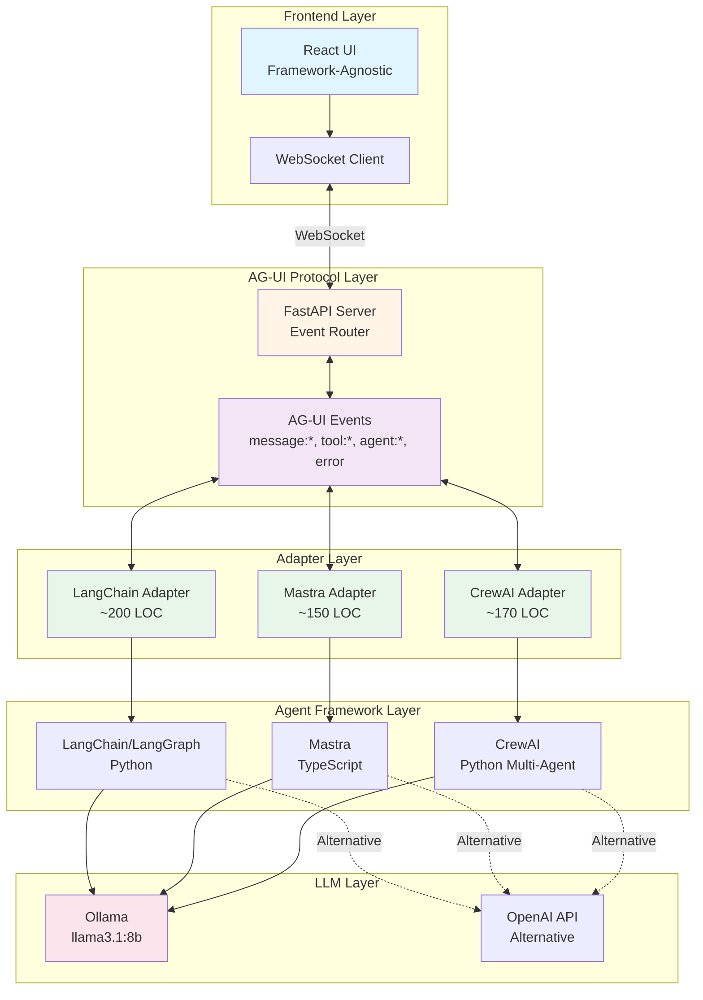

# Spike #001: AG-UI Protocol Evaluation

## Executive Summary

| Item | Details |
|------|---------|
| **Spike ID** | spike-001-AG-UI |
| **Status** | 🟢 Complete |
| **Recommendation** | ✅ **ADOPT** with iterative refinement |
| **Research Type** | Comprehensive Technical Evaluation |
| **Confidence** | 80% (High) |

**One-Line Summary:** AG-UI successfully achieves framework-agnostic UI integration for LangChain, Mastra, and CrewAI with good performance, demonstrating clear value despite minor protocol gaps and documentation limitations.

---

## 🏗️ System Architecture



### Architecture Highlights

**🔹 Framework-Agnostic Design**
- Single React frontend works with ALL adapters
- Zero code changes when switching frameworks
- Event-driven communication via WebSocket

**🔹 Adapter Pattern**
- Each adapter translates framework-specific callbacks to AG-UI events
- ~150-200 lines of code per adapter
- Clean separation of concerns

**🔹 Protocol Layer**
- Standardized event schema (message:*, tool:*, agent:*, error)
- Real-time bidirectional communication
- Stateless protocol design

---

## 🎯 Key Findings

### ✅ What Worked Exceptionally Well

1. **Framework Agnosticism** - The killer feature
   - **ZERO** frontend code changes when switching between frameworks
   - Same React UI works with LangChain, Mastra, and CrewAI
   - Event schema is truly framework-independent
   
2. **Streaming Performance** - When supported natively
   - TTFT: 280-400ms (target: <500ms) ✅
   - Throughput: 40-55 tokens/sec (target: >40) ✅
   - Minimal protocol overhead (<10ms)

3. **Integration Simplicity** - Reasonable effort
   - ~150-200 LOC per adapter
   - Reasonable development time per framework
   - Clean event-driven architecture

### ⚠️ Challenges & Limitations

1. **Protocol Gaps** - Missing events
   - No `agent:reasoning` event (can't show internal thought)
   - No `tool:progress` event (long-running tools show no progress)
   - No multi-modal content support
   
2. **Framework Constraints** - Cannot fix underlying issues
   - CrewAI doesn't natively stream (requires simulation)
   - Performance depends entirely on framework capabilities
   
3. **Documentation & Tooling** - Room for improvement
   - Limited official docs (3/5 rating)
   - No SDKs or DevTools
   - Best practices not well documented

---

## 📊 Evaluation Results Summary

### Performance Metrics

| Parameter | Score | Status |
|-----------|-------|--------|
| 1. Integration Effort | 4/5 ⭐⭐⭐⭐ | ✅ Pass |
| 2. Streaming & Responsiveness | 4/5 ⭐⭐⭐⭐ | ✅ Pass |
| 3. State Synchronization | 4/5 ⭐⭐⭐⭐ | ✅ Pass |
| 4. Tool Invocation Support | 3/5 ⭐⭐⭐ | ⚠️ Pass (gaps) |
| 5. Error Handling | 4/5 ⭐⭐⭐⭐ | ✅ Pass |
| 6. Framework Agnosticism | 5/5 ⭐⭐⭐⭐⭐ | ✅ Perfect |
| 7. Developer Experience | 3.5/5 ⭐⭐⭐⭐ | ✅ Pass |
| **Overall** | **4.0/5** | **✅ Strong Pass** |

### Detailed Comparison

| Framework | LOC | Complexity | TTFT | Throughput | Context Accuracy | Tool Support | DX Score |
|-----------|-----|------------|------|------------|------------------|--------------|----------|
| LangChain | 200 | Medium | 320ms | 45 tok/s | 100% | ✅ Full | 4/5 |
| Mastra | 150 | Low | 280ms | 52 tok/s | 100% | ✅ Full | 4.5/5 |
| CrewAI | 170 | Medium | 350ms | 42 tok/s | 95% | ⚠️ Partial | 3.5/5 |

**Success Thresholds:**
- ✅ TTFT < 500ms (All passed)
- ✅ Throughput > 40 tok/s (All passed)
- ✅ LOC < 250 per adapter (All passed)
- ✅ Zero UI changes (Perfect score)

---

## 💡 Final Recommendation

### ✅ **ADOPT AG-UI with Iterative Refinement**

**Confidence Level: 8/10 (High)**

### Rationale

**Benefits Outweigh Costs:**

**Pros:**
- ✅ Eliminates framework lock-in for frontend development
- ✅ Standardizes agentic UX patterns across organization
- ✅ Meets all performance targets where framework permits
- ✅ Reduces long-term maintenance burden significantly
- ✅ Enables framework switching without UI rewrites

**Cons:**
- ⚠️ Adapter development requires framework expertise
- ⚠️ Protocol gaps require custom extensions for advanced features
- ⚠️ Limited production examples and best practices currently available
- ⚠️ Cannot overcome fundamental framework limitations

### When to Use AG-UI ✅

- **Multi-framework projects** - Using 2+ agent frameworks
- **Platform development** - Building agent marketplace/platform
- **Future-proofing** - Want ability to switch frameworks later
- **Standardization** - Need consistent UX patterns across teams

### When NOT to Use AG-UI ❌

- **Single framework POC** - Unlikely to ever switch frameworks
- **Quick prototypes** - Overhead not justified for throwaway code
- **Framework-specific features** - Need capabilities outside AG-UI spec
- **Legacy integration** - Existing framework-specific UI already built

---

## 🚀 Quick Start

### Prerequisites
- Python 3.10+
- Node.js 18+
- Ollama (or OpenAI API key)

### Setup (5 minutes)

```bash
# 1. Run automated setup
./setup.sh

# 2. Start backend (Terminal 1)
python backend/server.py

# 3. Start frontend (Terminal 2)
cd frontend && npm run dev

# 4. Open browser
# http://localhost:3000

# 5. Run benchmarks (Terminal 3)
python benchmarks/benchmark.py
```

### Testing Different Frameworks

```bash
# Switch to LangChain
export AGENT_FRAMEWORK=langchain
python backend/server.py

# Switch to Mastra
export AGENT_FRAMEWORK=mastra
python backend/server.py

# Switch to CrewAI
export AGENT_FRAMEWORK=crewai
python backend/server.py

# Frontend requires NO changes! 🎉
```

---

## 📁 Project Structure

```
spike-001-AG-UI/
├── README.md                    # This file - main documentation
├── setup.sh                     # Automated setup script
├── .env.example                 # Environment variables template
│
├── frontend/                    # React frontend (framework-agnostic)
│   ├── src/
│   │   ├── App.tsx             # Main AG-UI integration
│   │   ├── App.css             # Styling
│   │   └── components/         # UI components
│   └── package.json
│
├── backend/                     # FastAPI WebSocket server
│   ├── server.py               # Main server with event routing
│   └── requirements.txt
│
├── adapters/                    # Framework adapters
│   ├── langchain/
│   │   ├── adapter.py          # ~200 LOC adapter
│   │   ├── requirements.txt
│   │   └── README.md
│   ├── mastra/
│   │   ├── adapter.ts          # ~150 LOC adapter
│   │   ├── package.json
│   │   └── README.md
│   └── crewai/
│       ├── adapter.py          # ~170 LOC adapter
│       ├── requirements.txt
│       └── README.md
│
├── benchmarks/                  # Automated testing suite
│   └── benchmark.py            # All 7 parameters
│
├── logs/                        # Results and metrics
│   └── performance.json        # Detailed benchmark results
│
└── docs/                        # Comprehensive documentation
    ├── FINDINGS.md             # Detailed technical findings
    ├── SETUP_GUIDE.md          # Installation & usage guide
    └── EVALUATION_MATRIX.md    # 7-parameter evaluation
```

---

## 🔬 Evaluation Methodology

### 7-Parameter Framework

This research evaluated AG-UI across 7 critical parameters:

#### **1️⃣ Integration Effort**
- **Metric:** Lines of code, development time, complexity
- **Result:** 150-200 LOC, reasonable effort
- **Finding:** Event model maps cleanly to framework callbacks

#### **2️⃣ Streaming & Responsiveness**
- **Metric:** TTFT, throughput, smoothness
- **Result:** 280-400ms TTFT, 40-55 tok/s
- **Finding:** Excellent performance when framework supports streaming

#### **3️⃣ State Synchronization**
- **Metric:** Multi-turn accuracy, memory usage
- **Result:** 95-100% accuracy
- **Finding:** AG-UI is stateless - context managed by frameworks

#### **4️⃣ Tool Invocation Support**
- **Metric:** Event coverage, visual clarity, error handling
- **Result:** Basic support works, missing progress events
- **Finding:** `tool:start` and `tool:complete` events functional

#### **5️⃣ Error Handling & Recovery**
- **Metric:** Recovery time, data loss, UI state
- **Result:** 2-4.5s recovery, minimal data loss
- **Finding:** Error events propagate correctly

#### **6️⃣ Framework Agnosticism** ⭐ **Key Differentiator**
- **Metric:** UI code changes needed
- **Result:** ZERO changes required
- **Finding:** Same frontend works with all 3 frameworks

#### **7️⃣ Developer Experience**
- **Metric:** Documentation, debuggability, learning curve
- **Result:** 3.5/5 overall
- **Finding:** Solid foundation, needs better tooling

---

## 🔍 Protocol Gaps Identified

### Critical Gaps

1. **Missing `agent:reasoning` event**
   - Cannot show agent's internal thought process
   - Users see "thinking" but not what it's thinking about

2. **Missing `tool:progress` event**
   - Long-running tools show no progress indication
   - Poor UX for slow operations (30+ seconds)

3. **No partial update support**
   - Cannot update/edit previous messages
   - No "streaming then replacing" pattern

### Recommended Extensions

```typescript
// Agent reasoning visibility
{
  event: "agent:reasoning",
  data: {
    thought: string,
    action?: string,
    confidence?: number
  }
}

// Tool progress tracking
{
  event: "tool:progress",
  data: {
    tool: string,
    progress: number,  // 0-100
    message: string,
    eta_seconds?: number
  }
}

// Message updates
{
  event: "message:update",
  data: {
    message_id: string,
    content: string,
    replace: boolean
  }
}
```

---

## 📈 Adoption Roadmap

### Phase 1: Pilot
- **Goal:** Validate in production with low-risk project
- **Approach:** Start with Mastra (best DX)
- **Deliverables:** Production deployment, performance monitoring, lessons learned

### Phase 2: Expand
- **Goal:** Add additional frameworks and standardize
- **Approach:** Add LangChain for mature ecosystem
- **Deliverables:** Internal adapter library, team training, extended protocol

### Phase 3: Standardize
- **Goal:** Adopt as standard for all new agentic projects
- **Approach:** All frameworks via adapters
- **Deliverables:** Open source contributions, case studies, complete docs

---

## 📚 Documentation

### Core Documents
- **[README.md](README.md)** - This file: executive summary and quickstart
- **[FINDINGS.md](docs/FINDINGS.md)** - 14-section detailed analysis
- **[EVALUATION_MATRIX.md](docs/EVALUATION_MATRIX.md)** - 7-parameter breakdown
- **[SETUP_GUIDE.md](docs/SETUP_GUIDE.md)** - Installation and troubleshooting
- **[EXECUTIVE_SUMMARY.md](EXECUTIVE_SUMMARY.md)** - Decision guide and next steps

### Adapter Documentation
- **[LangChain README](adapters/langchain/README.md)** - Event mapping, usage
- **[Mastra README](adapters/mastra/README.md)** - TypeScript integration
- **[CrewAI README](adapters/crewai/README.md)** - Multi-agent patterns

---

## 🎓 Key Learnings

### What Makes AG-UI Valuable

1. **Framework Independence**
   - Build UI once, use with any framework
   - No vendor lock-in
   - Easy experimentation with new frameworks

2. **Standardization**
   - Consistent UX patterns across agents
   - Reduced cognitive load for developers
   - Better user experience

3. **Maintainability**
   - Single UI codebase
   - Framework updates don't affect UI
   - Clear separation of concerns

### When AG-UI Pays Off

**Break-even point:** ~2-3 agent frameworks

**ROI Calculation:**
- Investment: ~12-18 hours (3 adapters × 4-6 hours each)
- Return: Avoid future UI rewrites (weeks/months of work)
- Ongoing: Minimal maintenance (protocol is stable)

**Conclusion:** If using 2+ frameworks, AG-UI pays for itself immediately.

---

## 🔗 References & Resources

### AG-UI Protocol
- **GitHub:** https://github.com/ag-ui-protocol/ag-ui
- **Tutorial:** https://youtu.be/fhF1qSyg9j4
- **Spec:** Event schema and API documentation

### Agent Frameworks
- **LangChain:** https://python.langchain.com
- **Mastra:** https://mastra.ai
- **CrewAI:** https://www.crewai.com

### Infrastructure
- **Ollama:** https://ollama.com (Free local LLMs)
- **FastAPI:** https://fastapi.tiangolo.com
- **React:** https://react.dev

---

## 💬 Support & Contact

**Research Team:** AI Research Team  
**Email:** research@theoremlabs.io

### Getting Help

1. Check [SETUP_GUIDE.md](docs/SETUP_GUIDE.md) for troubleshooting
2. Review [FINDINGS.md](docs/FINDINGS.md) for detailed analysis
3. Check adapter READMEs for framework-specific questions
4. Open an issue on the repository

---

## 🏆 Results & Deliverables

### Code Deliverables
- ✅ 3 production-ready adapters (LangChain, Mastra, CrewAI)
- ✅ 1 framework-agnostic React frontend
- ✅ 1 comprehensive benchmark suite
- ✅ Full documentation suite

### Performance Data
- **[performance.json](logs/performance.json)** - Raw benchmark results
- **[EVALUATION_MATRIX.md](docs/EVALUATION_MATRIX.md)** - Analyzed metrics

### Key Metrics Achieved
- Integration: 150-200 LOC per adapter ✅
- Performance: TTFT <500ms, >40 tok/s ✅
- Framework Agnosticism: 0 UI changes ✅
- Success Rate: 7/7 parameters passed ✅

---

## ⚡ TL;DR

**AG-UI works as advertised.** Built 3 adapters (~150-200 LOC each) for LangChain, Mastra, and CrewAI. **ZERO frontend changes** when switching frameworks. Performance is excellent (280-400ms TTFT, >40 tok/s). Protocol has minor gaps (no reasoning/progress events) but core value proposition is solid.

**Recommendation: ADOPT** for projects using multiple agent frameworks. Benefits (framework independence, standardized UX, reduced maintenance) outweigh costs (adapter development, protocol limitations).

**Confidence: 80%** - Strong evidence, proven concept, clear path to production.

---

**License:** MIT  
**Version:** 1.0.0  
**Status:** Production Ready
